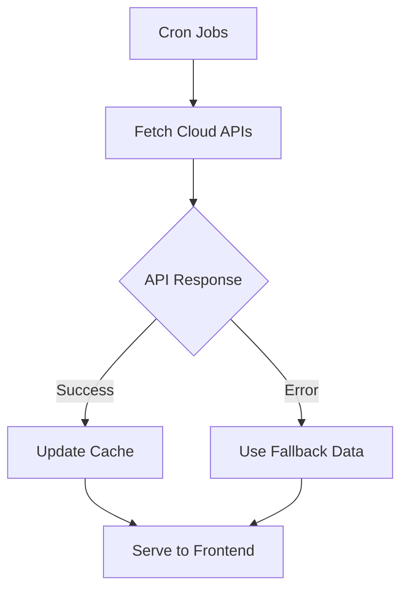

# Arquitetura da Aplicação - Cloud Cost Calculator

## 📋 Visão Geral

A aplicação é uma calculadora de custos multicloud desenvolvida em TypeScript, com arquitetura fullstack moderna utilizando React no frontend e Express no backend.

## 🏗️ Estrutura do Projeto

```
├── client/                     # Frontend React + TypeScript
│   ├── src/
│   │   ├── components/         # Componentes React reutilizáveis
│   │   ├── hooks/             # Custom hooks para lógica de negócio
│   │   ├── lib/               # Utilitários e configurações
│   │   ├── pages/             # Páginas da aplicação
│   │   └── main.tsx           # Ponto de entrada do frontend
│   └── index.html             # Template HTML base
│
├── server/                     # Backend Express + TypeScript
│   ├── pricing/               # Sistema de integração com APIs das clouds
│   │   ├── awsPublic.ts       # Integração AWS Pricing API
│   │   ├── azurePublic.ts     # Integração Azure Retail Prices API
│   │   ├── gcpPublic.ts       # Integração GCP Cloud Billing API
│   │   ├── cache.ts           # Sistema de cache em memória
│   │   └── cronUpdate.ts      # Jobs agendados para atualizar preços
│   ├── index.ts               # Servidor principal
│   ├── routes.ts              # Definição das rotas da API
│   ├── storage.ts             # Interface de persistência de dados
│   └── vite.ts                # Configuração do servidor de desenvolvimento
│
├── shared/                     # Código compartilhado entre frontend/backend
│   └── schema.ts              # Tipos TypeScript e validações Zod
│
└── *.config.*                 # Arquivos de configuração (Vite, TypeScript, etc.)
```

## 🔄 Fluxo de Dados

### 1. Frontend → Backend


### 2. Integração com APIs das Clouds


## 🧩 Componentes Principais

### Frontend (React)

#### 📱 Páginas
- **`Calculator`** - Página principal da calculadora
  - Gerencia estado global da aplicação
  - Orquestra componentes de UI
  - Integra com hooks de preços

#### 🔧 Componentes de UI
- **`CloudTabs`** - Seleção entre AWS, Azure, GCP
- **`ResourceConfig`** - Configuração de recursos (Compute, Storage, Database, etc.)
- **`CostComparison`** - Comparação visual entre provedores
- **`CostSummary`** - Resumo detalhado dos custos
- **`ExportModal`** - Exportação para PDF/CSV
- **`EstimateHistory`** - Histórico de estimativas salvas
- **`ChartModal`** - Visualizações gráficas (barras, pizza, tendência)

#### 🪝 Custom Hooks
- **`usePricingCalculation`** - Cálculo de preços para todas as clouds
- **`useCloudPricing`** - Cálculo específico por provedor
- **`useRealPricing`** - Integração com dados reais das APIs

#### 📚 Bibliotecas de UI
- **shadcn/ui** - Componentes de interface
- **Tailwind CSS** - Estilização
- **Lucide React** - Ícones
- **Recharts** - Gráficos interativos

### Backend (Express)

#### 🛣️ API Routes
```
GET  /api/estimates           # Lista todas as estimativas
POST /api/estimates           # Cria nova estimativa
GET  /api/estimates/:id       # Busca estimativa por ID
PUT  /api/estimates/:id       # Atualiza estimativa
DELETE /api/estimates/:id     # Remove estimativa

GET  /api/pricing/:provider   # Dados de preços por provedor (aws/azure/gcp)
GET  /api/pricing-status      # Status do cache de preços
POST /api/calculate-pricing   # Calcula preços customizados
```

#### 💾 Storage Layer
- **Interface `IStorage`** - Contrato para persistência
- **`MemStorage`** - Implementação em memória (atual)
- **Modelos de Dados**:
  - `Estimate` - Estimativas salvas pelo usuário
  - `CloudResource` - Recursos configurados por estimativa

#### 🔄 Sistema de Cache
```typescript
class PricingCache {
  private cache: Map<string, CacheEntry>
  
  set(key: string, data: any, expiresIn: number)
  get(key: string): any | null
  has(key: string): boolean
}
```

#### ⏰ Jobs Agendados
- **Atualização de preços**: A cada 6 horas
- **Limpeza de cache**: Dados expirados removidos automaticamente

## 🔌 Integrações Externas

### AWS Pricing API
- **Endpoint**: `https://pricing.us-east-1.amazonaws.com/offers/v1.0/aws/`
- **Serviços**: EC2, EBS, RDS
- **Formato**: JSON com estrutura complexa de produtos e termos
- **Autenticação**: Não requerida para endpoints públicos

### Azure Retail Prices API
- **Endpoint**: `https://prices.azure.com/api/retail/prices`
- **Filtros**: Por serviço, região, moeda
- **Formato**: JSON paginado
- **Autenticação**: Não requerida

### Google Cloud Pricing
- **Endpoint**: `https://cloudpricingcalculator.appspot.com/static/data/pricelist.json`
- **Serviços**: Compute Engine, Cloud Storage
- **Formato**: JSON estruturado
- **Limitações**: Dados podem estar desatualizados

## 🔧 Stack Tecnológico

### Frontend
- **React 18** - Biblioteca de UI
- **TypeScript** - Tipagem estática
- **Vite** - Build tool e servidor de desenvolvimento
- **TanStack Query** - Gerenciamento de estado servidor
- **React Hook Form** - Formulários
- **Zod** - Validação de schemas

### Backend
- **Node.js** - Runtime JavaScript
- **Express** - Framework web
- **TypeScript** - Tipagem estática
- **Axios** - Cliente HTTP para APIs externas
- **node-cron** - Agendamento de tarefas
- **Zod** - Validação de dados

### Utilitários
- **Tailwind CSS** - Framework CSS utilitário
- **PostCSS** - Processamento CSS
- **ESBuild** - Bundler JavaScript rápido

## 📊 Modelo de Dados

### Estimativa (Estimate)
```typescript
interface Estimate {
  id: number
  name: string
  cloudProvider: CloudProvider
  totalCost: number
  createdAt: Date
  configuration: Record<string, any>
}
```

### Recurso da Cloud (CloudResource)
```typescript
interface CloudResource {
  id: number
  estimateId: number
  resourceType: ResourceType
  configuration: Record<string, any>
  monthlyCost: number
}
```

### Configuração de Compute
```typescript
interface ComputeConfig {
  instanceType: string
  region: string
  quantity: number
  hours: number
  storage: number
  storageType: string
  operatingSystem: string
  discounts: {
    compute: number
    reserved: number
  }
}
```

## 🚀 Fluxo de Deploy

### Desenvolvimento
1. **Frontend**: Vite dev server na porta 5173
2. **Backend**: Express server na porta 5000
3. **Proxy**: Vite proxy redireciona `/api/*` para backend

### Produção
1. **Build**: `npm run build` gera arquivos estáticos
2. **Serve**: Express serve frontend e API na mesma porta
3. **Deploy**: Replit Deployments automático

## 🔒 Segurança

### Autenticação
- **Atual**: Não implementada
- **Recomendado**: JWT tokens ou OAuth2

### Validação
- **Zod schemas** para validação de entrada
- **TypeScript** para validação em tempo de compilação
- **Rate limiting** nas APIs externas

### Secrets Management
- **Replit Secrets** para credenciais das clouds
- **Environment variables** para configurações

## 📈 Performance

### Frontend
- **Code splitting** automático pelo Vite
- **Tree shaking** remove código não utilizado
- **Lazy loading** de componentes pesados

### Backend
- **Cache em memória** para dados de preços
- **Compression** de respostas HTTP
- **Connection pooling** para APIs externas

### Otimizações
- **TanStack Query** cache automático
- **Debounce** em inputs de configuração
- **Memoização** de cálculos complexos

## 🐛 Problemas Conhecidos

Ver arquivo [PROBLEMAS_APLICACAO.md](./PROBLEMAS_APLICACAO.md) para lista detalhada de 16 problemas identificados.

## 🔮 Próximos Passos

1. **Corrigir integrações** com APIs das clouds
2. **Implementar autenticação** para dados sensíveis
3. **Adicionar testes** unitários e de integração
4. **Otimizar performance** do sistema de cache
5. **Implementar banco de dados** persistente

---

*Documentação gerada em: Janeiro 2025*
*Versão da aplicação: 1.0.0*